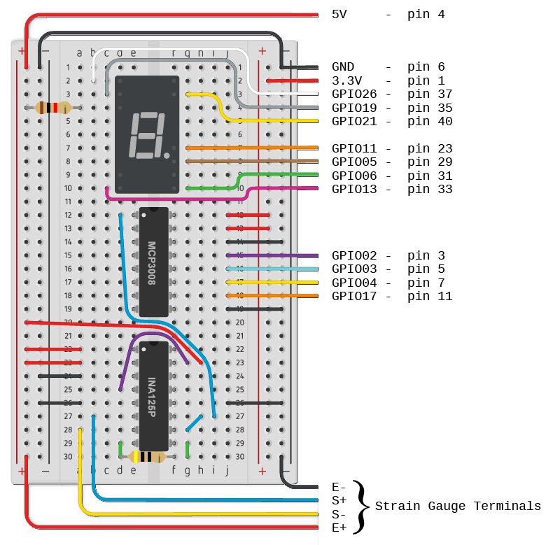
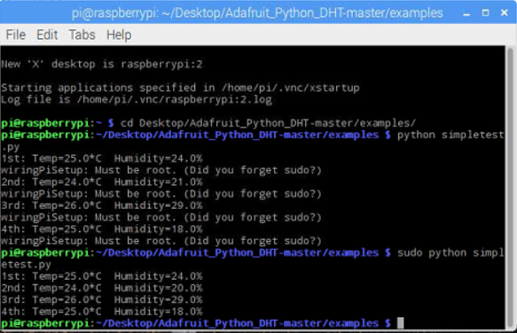
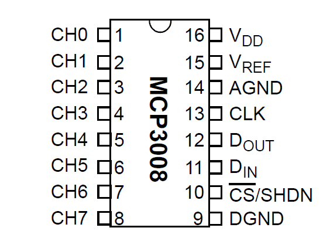
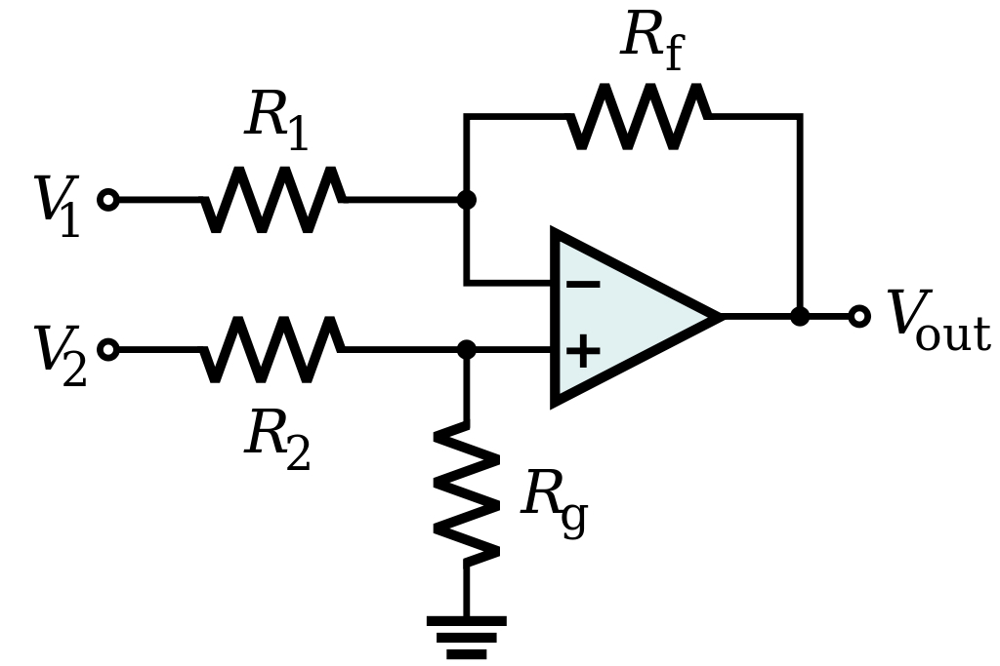
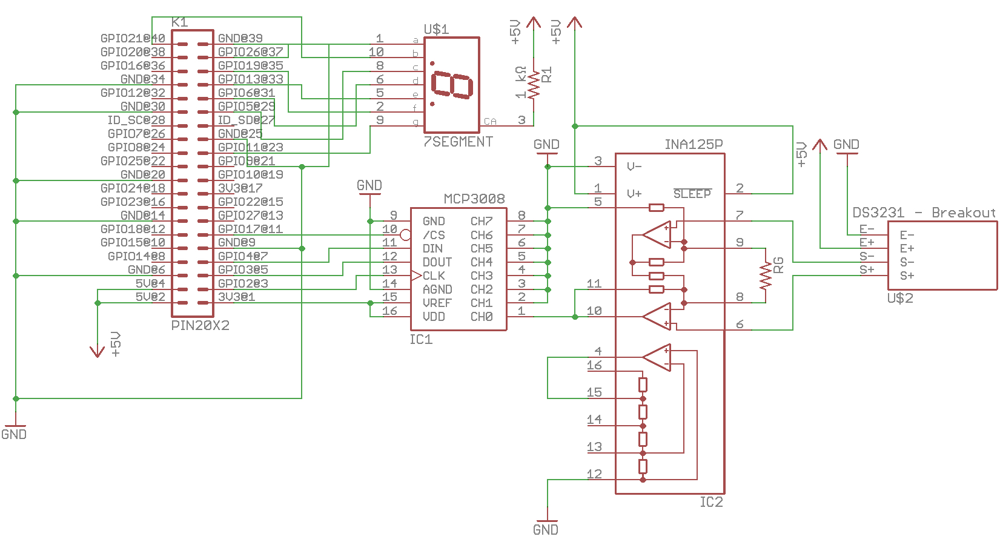
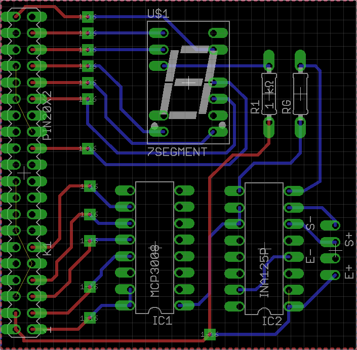
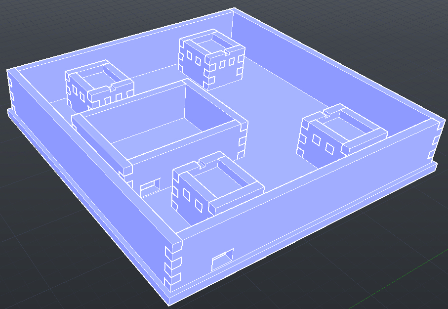

\vfill March 31, 2017

\pagebreak \linespread{2} \selectfont

**Declaration of Joint Authorship**
===================================

Roberto Loja, Yuri Sentsiv, and Paul Westman, the members of team Smart Hive,
confirm that the concepts presented in this report have resulted from original
thinking and research. All references to previously existing work have been
appropriately cited throughout this document, as well as comprehensively
accounted in its bibliography. As far as possible, we have evenly divided all
work amongst ourselves. Though all members participated in all tasks to some
extent, our primary areas of responsibility were as follows. Roberto Loja was
responsible for interfacing our IoT hive with our remote database, by writting
software that aggregates and uploads all sensor data into a format usable by
client applications. He was also responsible for the strain gauge circuit used
to gather weight data from the hive, as well as the design of the physical
package of the Smart Hive hardware. Finally, Roberto contributed a significant
portion of the code base for our mobile application. Yuri Sentsiv was
responsible for the interface between our remote database and our mobile
application, as well as designing and implementing the hardware system that,
using temperature sensors, tracks the physical location of the bee cluster
inside a hive. Further, Yuri was integral to the user interface design and
usability testing of the mobile application, as well as the integration of the
GPS system of target mobile devices. Paul Westman was responsible for developing
the hardware and software for tracking a hive’s ingress and egress, thus
providing an indirect population count. Paul was crucial in ensuring the mobile
application’s compliance with Material Design guidelines, as well as designing
the database schema and maintaining data consistency. Finally, Paul acted as the
scrum master in the development of the application, coordinating the team's
workflow, managing supplies, ordering parts, scheduling meetings, and keeping
track of the project schedule.

\pagebreak

**Approved Proposal**
=====================

*Proposal for the development of* [Smart Hive](pwestman.github.io)

Prepared by Roberto Loja, Yurii Sentsiv, Paul Westman  
*Computer Engineering Technology Students*

Project Website: pwestman.github.io

January 20, 2017

### **Executive Summary**

As students in the Computer Engineering Technology program, We will be
integrating the knowledge and skills we have learned from our program into this
Internet of Things themed capstone project. This proposal requests the approval
to build the hardware portion that will connect to a database as well as to a
mobile device application. The internet connected hardware will include a custom
PCB with sensors and actuators for tracking and recording the movement of bees
in and out of the hive. The database will store the population of bees inside
the hive as well as temperature and humidity readings. The mobile device
functionality will include requesting the most recent readings of population of
bees in the hive, temperature and humidity and will be further detailed in the
mobile application proposal. We will be collaborating with the following
company/department: Humber Honey Bees.

### **Background**

The problem solved by the project is finding a non-invasive way of tracking bee
populations in the hive with varying temperature and humidity. With the depleted
population of Honey bees recently, accurate data in this area is crucial. Up to
date data can be requested and viewed from a mobile application that will be
developed and integrated with the hardware component over the next two
semesters.

The Humber Honey Bees are an initiative undertaken by Humber in June 2015 in an
attempt to rebuild the local population of Honey bees in the area around Humber
College. Honey bees are an essential part of our world as they are responsible
for pollinating many of the plants that we eat. Due to their declining
populations, studying and tracking them has never been more important.
Therefore, this project will attempt to compile crucial data on Honey bee
movement and population in the hive in varying temperatures and humidity.

We have searched for prior art via Humber’s IEEE subscription selecting “My
Subscribed Content” and have found and read articles that provide technical
background information:

The first article provides insight into a smart bee hive that measures
population, honey production, and temperature/humidity. [@5753235]

The next article introduces the use of strain gauges and instrumentation
amplifiers. [@5767428]

The last article demonstrates a method for estimating the population of a bee
hive by measuring the hive’s capacitance. [@7419791]

In the Computer Engineering Technology program we have learned about the
following topics from the respective relevant courses:

-   Java Docs from CENG 212 Programming Techniques In Java,

-   Construction of circuits from CENG 215 Digital And Interfacing Systems,

-   Rapid application development and Gantt charts from CENG 216 Intro to
    Software Engineering,

-   Micro computing from CENG 252 Embedded Systems,

-   SQL from CENG 254 Database With Java,

-   Web access of databases from CENG 256 Internet Scripting; and,

-   Wireless protocols such as 802.11 from TECH152 Telecom Networks.

This knowledge and skill set will enable us to build the subsystems and
integrate them together as our capstone project.

### **Methodology**

This proposal is assigned in the first week of class and is due at the beginning
of class in the second week of the fall and winter semesters. Our coursework
will focus on the first two of the 3 phases of this project:  
Phase 1 Hardware build.  
Phase 2 System integration.  
Phase 3 Demonstration to future employers.

*Phase 1 Hardware build*

The hardware build was completed in the fall term. It fit within the CENG
Project maximum dimensions of 12 13/16" x 6" x 2 7/8" (32.5cm x 15.25cm x
7.25cm) which represents the space below the tray in the parts kit. The highest
AC voltage that was allowed to be used was 16Vrms from a wall adaptor from which
+/- 15V or as high as 45 VDC. Maximum power consumption was to be no more than
20 Watts.

*Phase 2 System integration*

The system integration will be completed in the winter term.

*Phase 3 Demonstration to future employers*

This project will showcase the knowledge and skills that we have learned to
potential employers.

The tables below provide rough effort and non-labour estimates respectively for
each phase.

| **Labour Estimates**                                                                      | **Hrs**      | **Notes**                                                                                                                      |
|-------------------------------------------------------------------------------------------|--------------|--------------------------------------------------------------------------------------------------------------------------------|
| **Phase 1**                                                                               |              |                                                                                                                                |
| Writing proposal.                                                                         | 9            | Tech identification quiz.                                                                                                      |
| Creating project schedule. Initial project team meeting.                                  | 9            | Proposal due.                                                                                                                  |
| Creating budget. Status Meeting.                                                          | 9            | Project Schedule due.                                                                                                          |
| Acquiring components and writing progress report.                                         | 9            | Budget due.                                                                                                                    |
| Mechanical assembly and writing progress report. Status Meeting.                          | 9            | Progress Report due (components acquired milestone).                                                                           |
| PCB fabrication.                                                                          | 9            | Progress Report due (Mechanical Assembly milestone).                                                                           |
| Interface wiring, Placard design, Status Meeting.                                         | 9            | PCB Due (power up milestone).                                                                                                  |
| Preparing for demonstration.                                                              | 9            | Placard due.                                                                                                                   |
| Writing progress report and demonstrating project.                                        | 9            | Progress Report due (Demonstrations at Open House Saturday, November 7, 2015 from 10 a.m. - 2 p.m.).                           |
| Editing build video.                                                                      | 9            | Peer grading of demonstrations due.                                                                                            |
| Incorporation of feedback from demonstration and writing progress report. Status Meeting. | 9            | 30 second build video due.                                                                                                     |
| Practice presentations                                                                    | 9            | Progress Report due.                                                                                                           |
| 1st round of Presentations, Collaborators present.                                        | 9            | Presentation PowerPoint file due.                                                                                              |
| 2nd round of Presentations                                                                | 9            | Build instructions up due.                                                                                                     |
| Project videos, Status Meeting.                                                           | 9            | 30 second script due.                                                                                                          |
| **Phase 1 Total**                                                                         | **135**      |                                                                                                                                |
| **Phase 2**                                                                               |              |                                                                                                                                |
| Meet with collaborators                                                                   | 9            | Status Meeting                                                                                                                 |
| Initial integration.                                                                      | 9            | Progress Report                                                                                                                |
| Meet with collaborators                                                                   | 9            | Status Meeting                                                                                                                 |
| Testing.                                                                                  | 9            | Progress Report                                                                                                                |
| Meet with collaborators                                                                   | 9            | Status Meeting                                                                                                                 |
| Meet with collaborators                                                                   | 9            | Status Meeting                                                                                                                 |
| Incorporation of feedback.                                                                | 9            | Progress Report                                                                                                                |
| Meet with collaborators                                                                   | 9            | Status Meeting                                                                                                                 |
| Testing.                                                                                  | 9            | Progress Report                                                                                                                |
| Meet with collaborators                                                                   | 9            | Status Meeting                                                                                                                 |
| Prepare for demonstration.                                                                | 9            | Progress Report                                                                                                                |
| Complete presentation.                                                                    | 9            | Demonstration at Open House Saturday, April 9, 2016 10 a.m. to 2 p.m.                                                          |
| Complete final report. 1st round of Presentations.                                        | 9            | Presentation PowerPoint file due.                                                                                              |
| Write video script. 2nd round of Presentations, delivery of project.                      | 9            | Final written report including final budget and record of expenditures, covering both this semester and the previous semester. |
| Project videos.                                                                           | 9            | Video script due                                                                                                               |
| **Phase 2 Total**                                                                         | **135**      |                                                                                                                                |
| **Phase 3**                                                                               |              |                                                                                                                                |
| Interviews                                                                                | TBD          |                                                                                                                                |
| **Phase 3 Total**                                                                         | **TBD**      |                                                                                                                                |
| **Material Estimates**                                                                    | **Cost**     | **Notes**                                                                                                                      |
| **Phase 1**                                                                               |              |                                                                                                                                |
| Raspberry Pi 3 Model B                                                                    | \$80.00      | Creatron Inc.                                                                                                                  |
| Peripherals with cables                                                                   | \$5.00       |                                                                                                                                |
| Digital Bathroom Scale                                                                    | \$25.00      |                                                                                                                                |
| Resistors                                                                                 | \$2.00       |                                                                                                                                |
| Infrared Optical Interrupter Module                                                       | \$80.80      |                                                                                                                                |
| DHT11                                                                                     | \$17.00      |                                                                                                                                |
| **Phase 1 Total**                                                                         | **\$209.8​0** |                                                                                                                                |
| **Phase 2**                                                                               |              |                                                                                                                                |
| Materials to improve functionality, fit, and finish of project.                           |              |                                                                                                                                |
| **Phase 2 Total**                                                                         | **TBD**      |                                                                                                                                |
| **Phase 3**                                                                               |              |                                                                                                                                |
| Off campus colocation                                                                     | \<\$100.00   |                                                                                                                                |
| *Shipping*                                                                                | *TBD*        |                                                                                                                                |
| *Tax*                                                                                     | *TBD*        |                                                                                                                                |
| *Duty*                                                                                    | *TBD*        |                                                                                                                                |
| **Phase 3 Total**                                                                         | **TBD**      |                                                                                                                                |

### **Concluding remarks**

This proposal presents a plan for providing an IoT solution for bee tracking at
Humber College. This is an opportunity to integrate the knowledge and skills
developed in our program to create a collaborative IoT capstone project
demonstrating our ability to learn how to support projects. We request approval
of this project.

\pagebreak

**Abstract**
============

The western honey bee's prolific pollination of crops makes an enormous
contribution to agriculture. As this has been threatened by colony collapse
disorder, the time demands on experienced bee keepers have greatly increased. We
have aimed to lessen those demands by allowing beekeepers to remotely monitor
the health of hives. This project makes use of a compact package of carefully
chosen sensors, mounted on a beehive, that wouldn’t interfere with bee colony
life, whose readings can be monitored from an internet connected tablet or phone
using an app of our design. By lowering the time required to monitor each hive,
we aim to allow beekeepers to tend to a greater number of hives, and to focus on
those that require more attention, hopefully lessening the wider effects of
colony collapse.

\pagebreak

**Table of Contents**
=====================

### [Declaration of Joint Authorship](https://github.com/pwestman/pwestman.github.io#declaration-of-joint-authorship)

[Approved
Proposal](https://github.com/pwestman/pwestman.github.io#approved-proposal)

[Executive
Summary](https://github.com/pwestman/pwestman.github.io#executive-summary)

[Background](https://github.com/pwestman/pwestman.github.io#background)

[Methodology](https://github.com/pwestman/pwestman.github.io#methodology)

[Concluding
Remarks](https://github.com/pwestman/pwestman.github.io#concluding-remarks)

[Abstract](https://github.com/pwestman/pwestman.github.io#abstract)

### [Illustrations and Diagrams](https://github.com/pwestman/pwestman.github.io#illustrations-and-diagrams-1)

### [1. Product Introduction](https://github.com/pwestman/pwestman.github.io#1-product-introduction-1)

### [2. Requirements Specifications](https://github.com/pwestman/pwestman.github.io#2-requirements-specifications-1)

#### [2.1 Product Description](https://github.com/pwestman/pwestman.github.io#21-product-description-1)

[2.1.1 Problem To Be
Solved](https://github.com/pwestman/pwestman.github.io#211-problem-to-be-solved)

[2.1.2 Intended
Users](https://github.com/pwestman/pwestman.github.io#212-intended-users)

[2.1.3 Overview Of
Product](https://github.com/pwestman/pwestman.github.io#213-overview-of-product)

#### [2.2 System Description](https://github.com/pwestman/pwestman.github.io#22-system-description-1)

[2.2.1 Product
Perspective](https://github.com/pwestman/pwestman.github.io#221-product-perspective)

[2.2.2 Design
Constraints](https://github.com/pwestman/pwestman.github.io#222-design-constraints)

[2.2.3 Product
Functions](https://github.com/pwestman/pwestman.github.io#223-product-functions)

[2.2.4 User
Characteristics](https://github.com/pwestman/pwestman.github.io#224-user-characteristics)

[2.2.5 Constraints, Assumptions, and
Dependencies](https://github.com/pwestman/pwestman.github.io#225-constraints-assumptions-and-dependencies)

#### [2.3 Specific Requirements](https://github.com/pwestman/pwestman.github.io#23-specific-requirements-1)

[2.3.1 Database](https://github.com/pwestman/pwestman.github.io#231-database)

[2.3.2 Web
Interface](https://github.com/pwestman/pwestman.github.io#232-web-interface)

[2.3.3 Mobile
Application](https://github.com/pwestman/pwestman.github.io#233-mobile-application)

[2.3.4 Hardware](https://github.com/pwestman/pwestman.github.io#234-hardware)

[2.3.5
Performance](https://github.com/pwestman/pwestman.github.io#235-performance)

[2.3.6 Functional
Requirements](https://github.com/pwestman/pwestman.github.io#236-functional-requirements)

#### [2.4 Additional Requirements](https://github.com/pwestman/pwestman.github.io#24-additional-requirements-1)

[2.4.1 Security](https://github.com/pwestman/pwestman.github.io#241-security)

[2.4.2 Safety](https://github.com/pwestman/pwestman.github.io#242-safety)

#### [2.5 Build Instructions](https://github.com/pwestman/pwestman.github.io#25-build-instructions-1)

[2.5.1
Introduction](https://github.com/pwestman/pwestman.github.io#251-introduction)

[2.5.2 Bill of Materials and
Budget](https://github.com/pwestman/pwestman.github.io#252-bill-of-materials-and-budget)

[2.5.3 Time
Commitment](https://github.com/pwestman/pwestman.github.io#253-time-commitment)

[2.5.4 Mechanical
Assembly](https://github.com/pwestman/pwestman.github.io#254-mechanical-assembly)

[2.5.5 Software Setup and Power
Up](https://github.com/pwestman/pwestman.github.io#255-software-setup-and-power-up)

[2.5.6 Unit
Testing](https://github.com/pwestman/pwestman.github.io#256-unit-testing)

[2.5.6.1 Strain
Gauges](https://github.com/pwestman/pwestman.github.io#2561-strain-gauges)

[2.5.6.2 Population
Counting](https://github.com/pwestman/pwestman.github.io#2562-population-counting)

[2.5.6.3 Temperature and
Humidity](https://github.com/pwestman/pwestman.github.io#2563-temperature-and-humidity)

#### [2.6 Schedule](https://github.com/pwestman/pwestman.github.io#26-schedule-1)

#### [2.6.1 Phase 1](https://github.com/pwestman/pwestman.github.io#261-phase-1-1)

[2.6.1.1 Week 1: Writing
proposal](https://github.com/pwestman/pwestman.github.io#2611-week-1-writing-proposal)

[2.6.1.2 Week 2: Creating Project Schedule and Initial Project Team
Meeting](https://github.com/pwestman/pwestman.github.io#2612-week-2-creating-project-schedule-and-initial-project-team-meeting)

[2.6.1.3 Week 3: Creating Budget and Status
Meeting](https://github.com/pwestman/pwestman.github.io#2613-week-3-creating-budget-and-status-meeting)

[2.6.1.4 Week 4: Acquiring Components and Writing Progress
Report](https://github.com/pwestman/pwestman.github.io#2614-week-4-acquiring-components-and-writing-progress-report)

[2.6.1.5 Week 5: Mechanical Assembly and Writing Progress
Report](https://github.com/pwestman/pwestman.github.io#2615-week-5-mechanical-assembly-and-writing-progress-report)

[2.6.1.6 Week 6: PCB Fabrication (Power Up
Milestone)](https://github.com/pwestman/pwestman.github.io#2616-week-6-pcb-fabrication-power-up-milestone)

[2.6.1.7 Week 7: Interface Wiring, Placard Design, Status
Meeting](https://github.com/pwestman/pwestman.github.io#2617-week-7-interface-wiring-placard-design-status-meeting)

[2.6.1.8 Week 8: Preparing for
Demonstration](https://github.com/pwestman/pwestman.github.io#2618-week-8-preparing-for-demonstration)

[2.6.1.9 Week 9: Writing Progress Report and Demonstrating
Project](https://github.com/pwestman/pwestman.github.io#2619-week-9-writing-progress-report-and-demonstrating-project)

[2.6.1.10 Week 10: Editing Build
Video](https://github.com/pwestman/pwestman.github.io#26110-week-10-editing-build-video)

[2.6.1.11 Week 11: Incorporation of Feedback From Demonstration, Writing
Progress Report, and Status
Meeting](https://github.com/pwestman/pwestman.github.io#26111-week-11-incorporation-of-feedback-from-demonstration-writing-progress-report-and-status-meeting)

[2.6.1.12 Week 12: Practice
Presentations](https://github.com/pwestman/pwestman.github.io#26112-week-12-practice-presentations)

[2.6.1.13 Week 13: Presentations, Collaborators
Present](https://github.com/pwestman/pwestman.github.io#26113-week-13-presentations-collaborators-present)

[2.6.1.14 Week 14: Project Videos and Status
Meeting](https://github.com/pwestman/pwestman.github.io#26114-week-14-project-videos-and-status-meeting)

#### [2.6.2 Phase 2](https://github.com/pwestman/pwestman.github.io#262-phase-2-1)

[2.6.2.1 Week 1: Scheduling and Group
Meetings](https://github.com/pwestman/pwestman.github.io#2621-week-1-scheduling-and-group-meetings)

[2.6.2.2 Week 2: Group Project Status Update and Submission of Proposal Inline
Citation and Reference
Pages](https://github.com/pwestman/pwestman.github.io#2622-week-2-group-project-status-update-and-submission-of-proposal-inline-citation-and-reference-pages)

[2.6.2.3 Week 3: App, Web, and Database Software Requirements
Specification](https://github.com/pwestman/pwestman.github.io#2623-week-3-app-web-and-database-software-requirements-specification)

[2.6.2.4 Week 4: Group Project Status
Update](https://github.com/pwestman/pwestman.github.io#2624-week-4-group-project-status-update)

[2.6.2.5 Week 5: Technical Report Structure and Mechanics and Content for
Abstract, Introduction, and Declaration of
Authorship](https://github.com/pwestman/pwestman.github.io#2625-week-5-technical-report-structure-and-mechanics-and-content-for-abstract-introduction-and-declaration-of-authorship)

[2.6.2.6 Week 6: Group Project Status
Update](https://github.com/pwestman/pwestman.github.io#2626-week-6-group-project-status-update)

[2.6.2.7 Week 7: App, Web, and Database Independent Demonstration and Merging of
Build Instructions Into Body of Technical
Report](https://github.com/pwestman/pwestman.github.io#2627-week-7-app-web-and-database-independent-demonstration-and-merging-of-build-instructions-into-body-of-technical-report)

[2.6.2.8 Week 8: Group Project Status
Update](https://github.com/pwestman/pwestman.github.io#2628-week-8-group-project-status-update)

[2.6.2.9 Week 9: OACETT Basic Requirement Report
Checklist](https://github.com/pwestman/pwestman.github.io#2629-week-9-oacett-basic-requirement-report-checklist)

[2.6.2.10 Week 10: Group Project Status
Update](https://github.com/pwestman/pwestman.github.io#26210-week-10-group-project-status-update)

[2.6.2.11 Week 11: Technical Report
Due](https://github.com/pwestman/pwestman.github.io#26211-week-11-technical-report-due)

[2.6.2.12 Week 12: Group Project Status
Update](https://github.com/pwestman/pwestman.github.io#26212-week-12-group-project-status-update)

[2.6.2.13 Week 13: Spring Open House
Demonstrations](https://github.com/pwestman/pwestman.github.io#26213-week-13-spring-open-house-demonstrations)

[2.6.2.14 Week 14: Group
Presentations](https://github.com/pwestman/pwestman.github.io#26214-week-14-group-presentations)

[2.6.2.15 Week 15: Group Video Script Due, Filming, Demonstration of Project in
its Final
Form](https://github.com/pwestman/pwestman.github.io#26215-week-15-group-video-script-due-filming-demonstration-of-project-in-its-final-form)

### [3. Conclusions](https://github.com/pwestman/pwestman.github.io#3-conclusions-1)

### [4. Recommendations](https://github.com/pwestman/pwestman.github.io#4-recommendations-1)

### [5. References](https://github.com/pwestman/pwestman.github.io#5-references-1)

\pagebreak

**Illustrations and Diagrams**
==============================

Figure 1: Breadboard Showing ICs and Pin Numbers

Figure 2: Screen Shot of Temperature and Humidity Readings on the Raspberry Pi
Terminal

Figure 3: MCP 3008 Analog to Digital Converter

Figure 4: Circuit Diagram for Amplifier

Figure 5: Circuit Diagram for Finalized Circuit

Figure 6: Eagle File Representation

Figure 7: The Assembled Acrylic Scale Housing

\pagebreak

**1. Product Introduction**
===========================

The decline of the bee population has been a major threat to the future of
agriculture due to humans’ reliance on their activity for pollinating crops. As
technology has advanced, beekeepers have been left behind with very few
effective options for monitoring the activities of the bees in a hive. This
means that beekeepers do not have the most up to date data on the activity of
the hive, such as weight, population, and cluster location, unless they are
physically by the hive. Smart Hive aims to tackle this problem by incorporating
sensors into the hive to track these metrics and upload them to a database that
can be queried in real time by beekeepers using our Smart Hive application for
Android mobile devices, and provide the most up to date information 24/7.

Sensors incorporated into the hive are powered by a Raspberry Pi to collect data
on the population, weight, and cluster location of bees in the hive. This data
is uploaded to a database and available for beekeepers immediately to make
decisions on how to intervene to ensure the health of the hive. It is possible
to monitor multiple hives within the application, displaying their status at the
touch of a button.

Humber College got involved with beekeeping in June of 2015 with an initiative
called the Humber Honey Bees. This was a response to the rapid decline of the
bee population as an effort to raise awareness and study their activities.
However, the Humber Honey Bees do not have any smart tracking systems integrated
into the hives that are on campus. This presented the perfect opportunity for
our team to develop and eventually test the system through this initiative.

The idea of Smart Hive is to find a way to track the movements and metrics of
bees using sensors in the least invasive way possible, with up to date data
available by request in real time from our application built for Android
devices.

\pagebreak

**2. Requirements Specifications**
==================================

2.1 Product Description
-----------------------

### 2.1.1 Problem To Be Solved

This project aims to solve the problem of not being able to see inside a beehive
to determine its overall health. By incorporating sensors into a beehive,
beekeepers are able to get a deeper understanding of what is going on inside the
hive and if intervention is necessary by the beekeeper in order to maintain the
hive’s functionality.

### 2.1.2 Intended Users

This product is intended for beekeepers who are looking for a way to more
closely monitor what is going on inside the hives that they are responsible for.

### 2.1.3 Overview Of Product

Smart Hive includes a Raspberry Pi 3 Model B, as well as DHT11 sensors, Infrared
Optical Interrupter sensors, and a wheat stone bridge for measuring the
temperature, humidity, population, and weight of the hives.

2.2 System Description
----------------------

### 2.2.1 Product Perspective

This product is open source, with the hopes that users will modify and
distribute their own customized versions for the advancement of beekeeping
metrics.

### 2.2.2 Design Constraints

Smart Hive is meant to operate year round to gather metrics on the hive’s
health. This allows beekeepers to determine if human intervention is required
for the survival of the hive. However, the product is designed so that it will
not impact the daily movement of the bees.

### 2.2.3 Product Functions

The sensors attached to the Raspberry Pi 3 collect data from the various sensors
to provide a deeper understanding of what is going on inside the hive. The
metrics that this product measures are temperature, humidity, population, and
weight. The temperature and humidity give the beekeeper an idea of the climate
that their hives are currently in. The population lets the beekeeper know if
bees are dying and allows them to respond accordingly. The weight gives an idea
of how much honey is stored in the hive at any time and if it will be sufficient
to get the colony through the winter.

### 2.2.4 User Characteristics

The end user of this product will be a certified beekeeper who is actively
managing one or more hives. The user must have an Android smartphone in order to
monitor the status of the hive through the Smart Hive mobile application.

### 2.2.5 Constraints, Assumptions, and Dependencies

The mobile application runs on Android API 19 or higher. It works on a mobile
phone or a tablet. The software that is running on the Raspberry Pi is in a
Linux environment. The user of the application must be a certified beekeeper who
is actively managing bee hives.

2.3 Specific Requirements
-------------------------

### 2.3.1 Database

Smart Hive uses Google’s Firebase Database, which pairs easily with the Android
application that was developed for users to view hive information. Firebase has
enhanced statistics, authentication, as well as being a commonly used database
for Android IDE. We have fairly straightforward structure, which will contain
the user’s unique ID that will be automatically created when the user is
authenticated with the Google account. Under the user’s ID will be entries for
different hives, depending how many were activated. Under each hive, there will
be information about the location, creation date, name, humidity, population,
temperature, weight and date of last update. Further, the results will be
fetched and displayed in the Android app. Roberto will be responsible for
writing a short script that will execute once the Raspberry Pi has booted that
will make a new node in the database associated with the user that is using it.

### 2.3.2 Web Interface

One of the functions of Google’s Firebase service is providing statistics of app
usage by end-users. All of the data in the database is presented in spanning
list topology and it is relatively easy to track needed information. As the web
interface is already set up, Paul will be responsible for maintaining the web
interface and ensuring newly set up hives are being properly added to the
Firebase console database.

### 2.3.3 Mobile Application

The Android application was developed in order to give users easy access to the
up-to-date data on the hives. As stated previously, we are using Google’s
Firebase services, which includes database visualization as well as Google
authentication that is used on the mobile application’s Welcome screen. This
allows users to login to their account and see their specific hive information
and status. After the user has logged in, the main screen will display all of
the hives in the list. From there user can click on any of the hives and see
information about them. This information is fetched from the Firebase database.
Also, the user can discover the hive on the map, which can be updated from the
app in case the hive was moved. The information will be displayed in different
colors, indicating if there are any possible problems. Yurii will be responsible
for testing the mobile application once it is integrated with the database. He
will also be responsible for deployment and subsequent version control the final
version of the application (for example managing the Google Play Store page).

### 2.3.4 Hardware

The main processing unit that is used to collect the data and then upload it to
database is the Raspberry Pi 3 microcomputer. The product uses 3 different
sensors to track temperature, humidity, population, and weight. The DHT11 is
used in different locations in the hive so the readings of temperature and
humidity are more precise. Another function is locating the bee cluster, which
is dependent on temperature readings in different spots in the hive. The
Infrared Optical Interrupter module detects bees as they break the infrared beam
between the two barriers on the sensor. With a sensor on either side of the
entrance,it can track whether a bee is entering or exiting the hive and
increment or decrement a counter accordingly. A wheatstone bridge is used from a
modified bathroom scale and placed underneath the hive to measure they weight
changes of the hive. The weight sensor will help monitor the honey production to
ensure there is adequate supply to last the winter. Each of us will be
responsible for writing threaded scripts that will gather the readings from the
sensors that each of us are responsible for: Roberto is responsible for weight
data, Yurii is responsible for cluster location data, and Paul is responsible
for population count.

### 2.3.5 Performance

All of the changes that are made are displayed in real time in the app as long
as the user has an internet connection. The data retrieved by the hardware
becomes more useful over time. This is because patterns associated with
population and temperature become clearer with longer periods of time. But
overall, if the system is running for a few days, the population readings that
are uploaded to database should be more precise than when it was just launched.

### 2.3.6 Functional Requirements

The functional requirement for Smart Hive include being able to update the data
in the database in real time and be presented on the mobile application.
Therefore, there should be constant connection to the internet on the Raspberry
Pi. Smart Hive can use the Ethernet connection or Wi-Fi, which are both built
into the Raspberry Pi 3. There should also be a constant power supply to the
Raspberry Pi so the system can constantly retrieve and update the readings.

2.4 Additional Requirements
---------------------------

### 2.4.1 Security

The Smart Hive mobile application uses Google authentication to verify the user
before they are able to access any of the hives data. If the user does not have
a Google account, one can be created from the main page of the application.

### 2.4.2 Safety

Beekeepers should always wear industry standard protective equipment when
physically interacting with any active bee hives. This is necessary for the
initial setup of the hardware on the beehive.

2.5 Build Instructions
----------------------

### 2.5.1 Introduction

The purpose of Smart Hive is to provide beekeepers a simple and efficient way of
remotely monitoring their hives. Smart Hive focusses on key metrics such as hive
weight, population, and cluster location inside the hive.

This is done by integrating a number of sensors into the hive structure and
connecting them to a Broadcom Development Platform. The sensors upload data to a
local database hosted on the development platform that is then uploaded to a
Firebase database that can be queried by our Android mobile application.

Population data is gathered using G1A57HRJ00F IR Optical Interrupter modules
mounted on either side of the gates at the entrance of the hive. These sensors
register when a bee has entered or exited the hive based on which which detects
movement first. This increments or decrements the population count and uploads
it to the database.

Weight data is gathered using a Wheatstone bridge underneath the hive. The
weight on the scale is uploaded to the local database on the Broadcom
Development Platform periodically and then uploaded to the Firebase database.

Finally, DHT11 sensors are mounted on all four sides of the hive and track
temperature changes to locate the cluster of bees inside the hive. Depending on
which sensors register the highest temperature, we can determine where in the
hive that the bees are located.

### 2.5.2 Bill of Materials and Budget

The following table breaks down the costs for the components used in this
project. Many of these components can be ordered online where they can be found
for cheaper prices, if you are willing to order internationally and wait for the
increased shipping time.

| **Item**                                                  | **Quantity** | **Cost** |
|-----------------------------------------------------------|--------------|----------|
| Infrared Optical Interrupter Module (GP1A57HRJ00F)        | 10           | \$80.80  |
| Raspberry Pi Model B Complete Starter Kit – 32 GB Edition | 1            | \$112.99 |
| 12” F-F Jumper Cables                                     | 30           | \$15.19  |
| Acrylic Sheet                                             | 2            | \$7.58   |
| Sensitivity Control Temperature Humidity Sensor DHT11     | 4            | \$7.20   |
| Digital Bathroom Scale                                    | 1            | \$25.00  |
| Seven segment display                                     | 1            | \$6.50   |
| Breadboard                                                | 1            | \$8.80   |
| INA125P                                                   | 1            | \$8.89   |
| MCP3008                                                   | 1            | \$3.28   |
| 1 kΩ resistor                                             | 1            | \$0.15   |
| 39 Ω resistor                                             | 1            | \$0.15   |

### 2.5.3 Time Commitment

Smart Hive took us 30 weeks to develop and complete all aspects. Many of the
steps that we took to finish this project do not need to be repeated, as anyone
wishing to reproduce the project can download the files that we developed. This
includes all of the CAD files for building the hive and sensor housing as well
as the scripts running on the Broadcom Development Platform.

The table below breaks down the expected time for someone wishing to reproduce
the project on their own using our steps and files..

| **Task**                           | **Time Estimate**       |
|------------------------------------|-------------------------|
| Acquire components                 | \~1 day                 |
| Assemble circuit or make PCB       | \~20 minutes to 3 hours |
| Cut and assemble housing           | 20 minutes to 2 hours   |
| Integrate sensors into the housing | 2 hours                 |
| Copy microSD image                 | 40 minutes              |
| Configure Raspbian                 | 10 minutes              |
| Setup python code                  | 10 minutes              |
| Calibrate the system               | \~4 hours               |

### 2.5.4 Mechanical Assembly

Download the drawing files (.dwg and .svg) from
<https://github.com/pwestman/pwestman.github.io/tree/master/Hive>. These are all
of the CAD files that need to be printed on the sheets of acrylic. There should
be a total of 4 files that will need to be cut from the sheets of acrylic:

-   hive assembled.dwg

-   hive parts.dwg

-   hive_sensor_box.dwg

-   strain_gauge_housing_final.svg

First, assemble the four strain gauges into a wheatstone bridge. Each of the
strain gauges I used had three terminals: red, white and black. The above
diagram indicates how these terminals were wired. The remaining red terminals
correspond to Excite and Sense, denoted by E+, E-, S+, and S-.

However, some strain gauges only have 2 terminals and some have four. In case of
the former, you must add a wire to each leg of the wheatstone bridge. In the
latter case, you have a package that already contains a full wheatstone bridge,
and must only find out which terminals correspond with E+, E-, S+, and S-.

In order to determine the terminals of the strain gauges, measure the resistance
between each pair of terminals in the Wheatstone bridge. The resistance between
S+ and S- will change measurably, though not by very much, when weight is
applied.

Note that E+ and E- will be opposite each other, with S+ and S- between them.

Connect the pins from the two ICs to the following pins on the Broadcom
Development Platform as shown in the diagram below:

A housing has been designed to hold the circuit, Raspberry Pi, and sensors. It
is designed to be laser cut from 6 mm thick acryllic. The following file can be
input into a laser cutter.

Once the acryllic housing has been laser cut, assembly should be fairly
straightforward, since the pieces will only fit together in the appropriate
ways. Nonetheless, here are assembly instructions.

1.  Assemble the outer walls first. 

2.  The outer walls can then be slotted into the base. 

3.  Next, the Raspberry Pi's housing can be assembled and slotted into the base.
    Take note of the housing's orientation, as the pieces will not fit when
    oriented incorrectly.

4.  Each of the strain gauge holders can then be assembled and slotted into the
    base. There are four of these.

5.  The housing is finished. It may be secured using acryllic cement.

The bottom piece of the Raspberry Pi's housing must be modified to make room for
the microSD card. This can be accomplished with either a file or, ideally, a
router. A 3 millimeter deep groove, positioned to coincide with the middle peg
in both width and position, is sufficient.

Next, assemble the hive housing. These acrylic pieces will once again, only fit
together in the way they are meant to. This makes assembling the final pieces of
the acrylic housing straightforward and simple.

Next, place the IR Optical Interrupter sensors into the slots in the gate
housing module at the entrance to the hive.

Connect the signal pins of the sensors to the corresponding board pins on the
Broadcom Development Platform according to the chart below.

When looking at the acrylic entrance from the front, from left to right:

| **Sensor**         | **Raspberry Pi GPIO Pins (Board)** |
|--------------------|------------------------------------|
| 1st Sensor - Front | 16 (green/yellow)                  |
| 1st Sensor - Back  | 18 (green/white)                   |
| 2nd Sensor – Front | 21 (green/red)                     |
| 2nd Sensor - Back  | 13 (green/green)                   |
| 3rd Sensor – Front | 12 (white/green)                   |
| 3rd Sensor – Back  | 15 (green/orange)                  |
| 4th Sensor – Front | 29 (white/black)                   |
| 4th Sensor – Back  | 31 (white/white)                   |
| 5th Sensor – Front | 33 (white/blue)                    |
| 5th Sensor - Back  | 35 (white/red)                     |

Connect a single cable to pin 2 (5V) on the Broadcom Development Platform and
strip the rubber enclosure from the cable near the sensors and connect a small
cable that has been stripped at one end to the power pin on each sensor. Wrap
the two exposed sections together and cover in liquid electrical tape. Do the
same thing for ground from pin 6 on the Broadcom Development Platform to each
ground pin of the sensors.

Finally, attach the DHT11 sensor on each side of the hive’s housing to the pins
as outlined in the table below (when facing the entrance):

| **Sensor** | **Broadcom Development Platform Pin (Board)** |
|------------|-----------------------------------------------|
| Front      | 19                                            |
| Back       | 40                                            |
| Right      | 38                                            |
| Left       | 22                                            |

Connect the power and ground pins for each sensor to the power cable and ground
cable running from the Broadcom Development Platform (pin 2 and pin 6
respectively) in the same way as for the gate sensors by stripping the rubber
coding and splicing them together. In this way, all power and ground will be
shared amongst all the sensors, eliminating excessive cable running from from
the Broadcom Development Platform.

### 2.5.5 Software Setup and Power Up

From the project [repository](https://github.com/pwestman/pwestman.github.io),
download the latest Raspberry Pi Smart Hive image. Next, follow the instructions
located
[here](https://www.raspberrypi.org/documentation/installation/installing-images/README.md)
to load the image onto your SD card. At this point, you will run our setup
script which will ask you for the WiFi connection credentials such as SSID,
password, security type, and authentication type. This setup script will
generate a text file in the microSD card’s FAT32 partition. It will then display
this hive’s unique identifier QR code. You can now take this SD card and put it
into your Broadcom Development Platform. Once it is turned on, it will
automatically begin taking sensor readings once every hour.

The image you downloaded contains all of the software required to run the
non-mobile component of Smart Hive. When your Smart Hive first boots up, it will
use the WiFi credentials you supplied to connect itself to your network and the
Internet. Next, download and install the Smart Hive Android app from the Google
Play Store and rate it 5 stars. On your Android phone, run the Smart Hive app,
which will prompt you to sign in to Google. If this is your first hive, the
Android app will then request that you scan your hive’s unique identifier QR
code. Once this is done, Broadcom Development Platform will connect to Smart
Hive’s remote database and upload any sensor readings it has already gathered.
These will now be visible from the Android app and your Smart Hive is setup.

### 2.5.6 Unit Testing

#### 2.5.6.1 Strain Gauges

Likely due to its high gain, the strain gauge circuit evinces a degree of
eletromagnetic interference. An ideal solution might be to seal the circuit
within a Faraday cage, but I have opted to compensate for the interference in
software. To this end, the python script responsible for attaining sensor
readings takes one reading every 10 milliseconds and displays the average of
every 10 consecutive readings.

#### 2.5.6.2 Population Counting

Since this project provides complete build instructions, unit testing should not
be required for the IR sensors because we have done the unit testing to get the
project to work. However, if you encounter any problems in the mechanical
assembly, unit testing may be helpful. Here is some of the unit testing we did
on the IR sensors for counting population:

Testing one sensor:

~~~~~~~~~~~~~~~~~~~~~~~~~~~~~~~~~~~~~~~~~~~~~~~~~~~~~~~~~~~~~~~~~~~~~~~~~~~~~~~~
         GPIO.setmode(GPIO.BOARD)
            GPIO.setup(22,GPIO.OUT)
            GPIO.setup(16,GPIO.IN)

            count=0
            gate1=1

            try:
                while True:
                if GPIO.input(16)==0:
                    if gate1==1:
                        count+=1
                        GPIO.output(22,True)
                        time.sleep(0.2)
                        GPIO.output(22,False)
                        print count
                        gate1=0
        
~~~~~~~~~~~~~~~~~~~~~~~~~~~~~~~~~~~~~~~~~~~~~~~~~~~~~~~~~~~~~~~~~~~~~~~~~~~~~~~~

You can replace the GPIO.setup and GPIO.input functions with any pin you wish to
test. This will test if that one particular pin is working.

#### 2.5.6.3 Temperature and Humidity

For the unit testing I used my original program with reading temperature and
humidity, but instead of displaying only the avarage result I display all the
readings, then the following result should be expected:

Unit testing code can be found at <https://n01060890.github.io/buildlog.html>
under the Unit Testing heading.

If you don’t have the PCB with the LED, it’s ok, the program will still work.
With Adafruit library we can use any GPIO pin. In case if any of the sensor
isn’t operating properly, the program will take longer time to execute, as it
will try to access the sensor few times. If thank was unsuccessful, then the
message will appear, that will inform user that there a problem with particular
sensor.

2.6 Schedule
------------

### 2.6.1 Phase 1

#### 2.6.1.1 Week 1: Writing proposal

Before we began integration of our 3 separate projects, we designed and built
the hardware that would be the basis for Smart Hive. The population counter,
hive scale, and temperature and humidity tracking were proposed as separate
projects for the fall semester. The approved proposal can be seen earlier in
this report.

#### 2.6.1.2 Week 2: Creating Project Schedule and Initial Project Team Meeting

The project schedule can be viewed from
[https://pwestman.github.io/\#Section_7](https://pwestman.github.io/#Section_7)
by downloading the Microsoft Project file under Week 3.

#### 2.6.1.3 Week 3: Creating Budget and Status Meeting

The 3 separate budgets for the hardware components of Smart Hive can be viewed
at the following links:

Population counter:
[https://pwestman.github.io/\#Section_8](https://pwestman.github.io/#Section_8)

Temperature and Humidity:
[https://n01060890.github.io/\#Section_4](https://n01060890.github.io/#Section_4)

Weight:
[https://robertoloja.github.io/build/index.html\#Materials](https://robertoloja.github.io/build/index.html#Materials)

#### 2.6.1.4 Week 4: Acquiring Components and Writing Progress Report

**Progress Report: Paul Westman**

For the project Bee Tracker, I have submitted a project proposal outlining the
aim of the project and what it hopes to accomplish. A GitHub page has been setup
and can be viewed at the link pwestman.github.io where others can follow my
project as it is put together and even follow the steps to recreate their own
Bee Tracker. I have created a project schedule in the form of a Gantt chart,
outlining the key events and critical path of the project. This will allow me to
complete the project on time as I have outlined the specific tasks that need to
be completed and when they must be completed so as not to delay the submission
of the final project. I have also created a budget, outlining the parts that
will be needed to build the hardware required for Bee Tracker. These parts have
mostly been ordered, and now I am waiting on their arrival so that I can begin
to put together the hardware that will be responsible for collecting data from
the bee hive and sending it to the database.

Attached to this document are some of the receipts that were issued upon
ordering the required parts for the project. When these parts arrive, I will
document a portion of the unboxing to add to my GitHub page so that others who
may want to replicate the project can do so. I will also document putting the
hardware together so that others can replicate this process as well. As the
components begin to arrive, I will be adding these videos to my GitHub page as I
unbox and assemble each component.

**Progress Report: Yurii Sentsiv**

As for this time, my team members and me have figured out who is doing which
part of final project. I am doing the temperature/humidity sensors
implementation, in order to see the fluctuation of these data in the hive. This
will be useful to be able to understand what is happening with hives. In order
to be able to do it, after small research on web, I figured out that the best
sensor that will satisfy my needs is Temperature & Humidity Sensor DHT11. In
order to get more accurate measurement, I’ve bought 5 pieces of this sensor from
the local retailer.

#### 2.6.1.5 Week 5: Mechanical Assembly and Writing Progress Report

**Progress Report: Yurii Sentsiv**

At his point I've done soldering of the PCB which is due this week on my project
scedule. So far I need to check at prototype lab if the correct voltages are
produced, in order not to burn my Raspberry PI. So far I haven't experienced any
issues, except I need to make sure that my PCB works properly. Our teacher
Kristian Medri   
suggested our team to check the prototype of the project, which is simmilar to
our in Huber College, and contact teacher Peter Wheeler, who is in charge of
this project, to get useful information on what he researched. For my part of
the projct I've alredy got all the parts that I need and I am on trak in our
financial status. My budget so far is \$114.84 :

-   Raspberry Pi 3 Model B Board : CDN\$ 57.49

    -   Enokay Case for Raspberry Pi 3 : CDN\$ 9.99

    -   HDMI Cable : CDN\$ 9.99

    -   Protection glasses : CDN\$ 4.99

    -   DTH11 sensors x5: CDN\$ 16.89

    -   MicroSD 32gb : CDN\$ 16.49

**Progress Report: Roberto Loja**

Our group has, uniquely, divided each part of our ambitious project between
members. That is, rather than each team member building a different version of
the same, relatively simple device, we have opted to each research and build one
aspect of our final group project.

After much research and deliberation, including information gleamed from e-mails
I exchanged with Fran Freeman, member of the Toronto Beekeepers Cooperative and
one of the keepers of Humber's bees, we have decided to track the following
data:

Weight:

This is crucial, since bees do not truly hibernate. Instead, bees ball up into a
cluster (a big ball of bees), and flutter their wings, which causes their bodies
to vibrate, increasing the temperature of their immediate surroundings. As a
multitude of bees understakes this same behaviour, the temperature of the entire
cluster/hive is kept significantly above freezing.

Naturally, this behaviour expends energy, which the bees gain from consuming the
honey they have stocked up for winter. As they consume the honey, the hive's
weight decreases.

Thus, it is fatally important (for the bees) that beekeepers ensure that every
hive has enough honey to last through winter.

We aim to provide a running measure of a hive's weight, so that beekeepers can
estimate the likelihood of a hive's ability to survive through winter.

Population:

Although the beekeepers we contacted did not think that a running population
count could be accurate, I believe that I have devised a system to keep an
accurate count of a hive's population. I will elucidade this system in a future
post.

Regardless of our system's accuracy, we have reasoned that even a rough
population count could be helpful to beekeepers, since hives occasionally
"swarm". That is, for variagated reasons, a bee hive occasionally witnesses a
noticeable exodus of bees intending to establish a new hive elsewhere.

By keeping a rough count of population, via the sensing of bee egress and
ingress, we will be able to, at least, detect swarm behaviour, which should
prove to be a useful metric of hive health.

Temperature:

Finally, when bees cluster for winter, it is also important to know exactly
where in the hive the cluster is located. For example, if it is too close to a
corner, they run the risk of overheating.

In order to detect this, we will place a temperature sensor on each corner of
the hive, then use their readings to triangulate the cluster's position.

Based on a mutual assessment of our relative strengths, I have been tasked with
designing the sensor circuit for measuring the hive's weight.

#### 2.6.1.6 Week 6: PCB Fabrication (Power Up Milestone)

We initially designed a PCB when first experimenting with different sensors on
the Broadcom Development Platform. However, we didn’t end up using the PCBs that
we printed. A picture of the PCB can be seen
[here](https://pwestman.github.io/#Section_10).

#### 2.6.1.7 Week 7: Interface Wiring, Placard Design, Status Meeting

The placard for Smart Hive for the Fall Open House at Humber College can be seen
at
[https://pwestman.github.io/\#Section_12](https://pwestman.github.io/#Section_12)

#### 2.6.1.8 Week 8: Preparing for Demonstration

Preparing for the Open House presentation involved fine tuning our software and
modifying the prototypes that we had built to demonstrate individual
functionality of the population counter, temperature and humidity sensing, and
weight sensing.

#### 2.6.1.9 Week 9: Writing Progress Report and Demonstrating Project

**Progress Report: Paul Westman**

With the final components arriving earlier last week. I am on track to
demonstrate the functionality of Bee Tracker at the Open House on Saturday. I
will be showing the counting functionality of the bee hive where I am able to
keep a running count of how many bees are in the hive at any time by tracking
bees that have entered and left the hive. This will be done using the IR sensors
in the gateway at the front of the mock hive entrance that I cut from acrylic.
In my mock hive entrance, there are 5 openings, each 1cm wide and 2cm tall. For
the purpose of the open house, I will only be demonstrating the functionality of
the counting mechanism for one of these openings to keep things simple. To
demonstrate its functionality without bees, I will use a small marble that will
be rolled through the entrance to show how the sensors will work. I will be
using a GP1A57HRJ00F assembled module optical interrupter on either side of the
entrance as to detect when a bee is entering the hive or leaving, depending on
which of these sensors detects movement first.

Since a database has not been set up yet to store the information that is
collected from the sensor, I will be demonstrating the functionality by either
lighting up an LED when the sensor is activated or printing a running count to a
screen. In order to print a count to a screen, I will have to coordinate having
a monitor at the open house. Since I am not sure if this is feasible, an LED
will be my backup plan. Along with the other members of my group, we have cut a
mock hive from acrylic and will each be demonstrating a component of the fully
functional hive that we plan to integrate in the following semester with our
Android application.

Once the database is set up, I will be implementing the counter to keep a
running total of bees at various incremental points in time. The counter will
keep track of the number of bees in the hive by incrementing when a bee enters
and decrementing when a bee leaves, and pushing the value of the counter to the
database at a specified interval. However, for the open house I will simply be
demonstrating the functionality of the mechanism used to count the bees.

I have had to spend a bit more money than expected to get the parts that I
needed in time. Some of the obstacles I was facing were that the cheap
components were going to take too long to arrive and so I was forced to spend a
little bit extra in order to ensure the components were here in time for the
milestones. Otherwise the project is on track and on schedule to meet the
upcoming deadline of the November 12th open house at the college.

**Progress Report: Roberto Loja**

So far, I have been using an MCP 3008 Analog to Digital converter to receive the
strain gauge signal in my Raspberry Pi.

This is a 10-bit ADC, for which python code is readily available
(viz [Adafruit](https://www.adafruit.com/product/856)). It can be operated in
differential mode, taking the difference between two analog input channels.

However, when the strain gauges are plugged dirrectly into the ADC, the voltage
change between terminals is not detectable, being so small as to be overwhelmed
by interference. Thus, an amplifier is needed.

The above is a Differential Amplifier, which I built using standard 741 OpAmps.

When R1 = R2, the gain of the differential amplifier is equal to the ratio Rf /
Rg.

I experimented with a wide range of gain settings, but only ever managed to
achieve a ΔV of 0.5 V, from \~1.5 V to \~2.0 V. Since the MCP3008 used a ground
reference of 0 V and a Vref of 3.3 V, this amounted to a terrible waste of
resolution. This could be somewhat mitigated by using a voltage divider to
produce a Vref of 2 V, but this approach unnacceptably decreased the signal to
noise ratio of the circuit.

Given the nature of the 741 OpAmp, however, I was able to achieve nearly full
ADC resolution by supplying the 741s with -1 V and 5 V, since 741s tend only to
come within between 1 and 1.5 Volts of their supply voltages. Unfortunately,
this was also not a solution, since the amplifier must also be powered by the
Raspberry Pi, which can only provide 0 V, 3.3 V, and 5 V.

Finally, then, I decided to use a purpose built Instrumentation Amplifier,
namely the INA125P. This achieved the desired result of using the full 10 bits
of resolution from the ADC.

#### 2.6.1.10 Week 10: Editing Build Video

The population counter, temperature and humidity, and hive scale were built
separately and thus had individual build videos. They can be viewed at the links
below:

Population:
[https://pwestman.github.io/\#Section_13](https://pwestman.github.io/#Section_13)

Temperature and humidity:
[https://n01060890.github.io/\#Section_9](https://n01060890.github.io/#Section_9)

Scale:
[https://robertoloja.github.io/index.html](https://robertoloja.github.io/index.html)

#### 2.6.1.11 Week 11: Incorporation of Feedback From Demonstration, Writing Progress Report, and Status Meeting

**Progress Report: Paul Westman**

With the final components arriving earlier last week. I am on track to
demonstrate the functionality of Bee Tracker at the Open House on Saturday. I
will be showing the counting functionality of the bee hive where I am able to
keep a running count of how many bees are in the hive at any time by tracking
bees that have entered and left the hive. This will be done using the IR sensors
in the gateway at the front of the mock hive entrance that I cut from acrylic.
In my mock hive entrance, there are 5 openings, each 1cm wide and 2cm tall. For
the purpose of the open house, I will only be demonstrating the functionality of
the counting mechanism for one of these openings to keep things simple. To
demonstrate its functionality without bees, I will use a small marble that will
be rolled through the entrance to show how the sensors will work. I will be
using a GP1A57HRJ00F assembled module optical interrupter on either side of the
entrance as to detect when a bee is entering the hive or leaving, depending on
which of these sensors detects movement first.

Since a database has not been set up yet to store the information that is
collected from the sensor, I will be demonstrating the functionality by either
lighting up an LED when the sensor is activated or printing a running count to a
screen. In order to print a count to a screen, I will have to coordinate having
a monitor at the open house. Since I am not sure if this is feasible, an LED
will be my backup plan. Along with the other members of my group, we have cut a
mock hive from acrylic and will each be demonstrating a component of the fully
functional hive that we plan to integrate in the following semester with our
Android application.

Once the database is set up, I will be implementing the counter to keep a
running total of bees at various incremental points in time. The counter will
keep track of the number of bees in the hive by incrementing when a bee enters
and decrementing when a bee leaves, and pushing the value of the counter to the
database at a specified interval. However, for the open house I will simply be
demonstrating the functionality of the mechanism used to count the bees.

I have had to spend a bit more money than expected to get the parts that I
needed in time. Some of the obstacles I was facing were that the cheap
components were going to take too long to arrive and so I was forced to spend a
little bit extra in order to ensure the components were here in time for the
milestones. Otherwise the project is on track and on schedule to meet the
upcoming deadline of the November 12th open house at the college.

**Progress Report: Yurii Senstiv**

This week is our Individual progress report due, as well as Hardware
Demonstration at Open House Saturday November 12 10am – 2pm.

At his point we were able to laser cut our casing for the project in prototype
lab, using CorelDRAW software. All the slots were cutted to hold all the sensors
used. Also, I was wiring and writing software for my sensors to work together
and give cluster information location. So far all the reading are working, but
the logic on cluster detection is still under development. I should be able to
accomplish everything by Saturday. So far I am following the project schedule.

So far the development and creating the casing was made by our team last week.
At this point everyone is working on his own individual hardware part.

The only problem that I've encountered, was burning one of my sensors, due to
inattention to circuit built.

So far, on financial side, nothing been changed.

**Progress Report: Roberto Loja**

The circuit design has been finalized.

A printed circuit board was designed, based on the above schematic, which can
simply be plugged into the Raspberry Pi's GPIO bus.

Finally, a housing has been designed to hold the Raspberry Pi and strain gauges.

#### 2.6.1.12 Week 12: Practice Presentations

This week was spent putting together and practicing for the in class
presentations.

#### 2.6.1.13 Week 13: Presentations, Collaborators Present

The presentation slides can be viewed from the link below:

Population:
[https://pwestman.github.io/\#Section_17](https://pwestman.github.io/#Section_17)

Temperature and Humidity:
[https://n01060890.github.io/\#Section_13](https://n01060890.github.io/#Section_13)

Scale:
[https://robertoloja.github.io/index.html](https://robertoloja.github.io/index.html)

#### 2.6.1.14 Week 14: Project Videos and Status Meeting

The project videos were shot in the Prototype Lab at Humber College. We were not
given access to these videos. If you wish to view them, please get in contact
with the Applied Technology Department at Humber College.

### 2.6.2 Phase 2

#### 2.6.2.1 Week 1: Scheduling and Group Meetings

This week involved conducting meetings and beginning to prepare for the
integration process of the population counter, temperature and humidity sensing,
and scale into the final version of Smart Hive.

#### 2.6.2.2 Week 2: Group Project Status Update and Submission of Proposal Inline Citation and Reference Pages

The proposal for Smart Hive can be seen earlier in this report under the
Approved Proposal section.

#### 2.6.2.3 Week 3: App, Web, and Database Software Requirements Specification

The Software Requirements Specification can be seen in this document under
section 2.3 Specific Requirements.

#### 2.6.2.4 Week 4: Group Project Status Update

Kristian,

What follows is an account of our current progress.

We are currently on schedule, viz the Gantt chart we submitted in first
semester. We have begun researching the methods by which we will asynchronously
gather sensor data and upload it to our database, which we expect to have
finished in the coming weeks. Further, we are on track to have a fully working
prototype by the Open House on April 8th at Humber College.

All three independent hardware components have been completed, and our Android
mobile application is nearly ready for release. At this point, we are focused on
integration of the three hardware components into a single product. Over the
coming weeks, we hope to acquire a Langstroth hive in order to integrate our
hardware and begin production testing. We have made contact with people and
organizations from whom we might borrow a hive. Failing that, our plan is to
either build or buy a hive or suitable simulacrum. We estimate the cost of a
nucleus Langstroth hive at around \$50. This cost will not be included in the
total build cost since we will use it for testing, and this would not be an
expense incurred by anyone already in possession of a hive.

Our estimated budget for the integration phase of the project is \$300 and we
are currently under budget. Barring unforeseen expenses, we will not exceed our
budget this term, since all required components have already been acquired.

Our biggest current challenge is testing. It will be difficult or impossible to
test our final product during winter, as the bees are still clustered inside the
hive. This means that any real life testing will have to wait until spring. In
the meantime, we are planning on designing mock-ups to simulate expected use
conditions. Thus, we must acquire a Langstroth hive, or a suitable stand-in, in
order to simulate the types of bee activity we intend to measure.

Thank you,

Team Smart Hive

Roberto Loja

Yurii Sentsiv

Paul Westman

#### 2.6.2.5 Week 5: Technical Report Structure and Mechanics and Content for Abstract, Introduction, and Declaration of Authorship

This week involved writing the
[Abstract](https://github.com/pwestman/pwestman.github.io#abstract),
[Introduction](https://github.com/pwestman/pwestman.github.io#1-product-introduction-1),
and [Declaration of Joint
Authorship](https://github.com/pwestman/pwestman.github.io#declaration-of-joint-authorship).

#### 2.6.2.6 Week 6: Group Project Status Update

Dear Kristian,

Over the past week, we made significant progress on the physical housing for
Smart Hive. We designed the prototype that takes all of our independent models
into account for tracking the weight, population and physical location of bee
cluster in the hive and integrated them into a single unit. We designed the
enclosure keeping in mind the specific sizes and functionalities of all the
sensors, as well as leaving adequate space for cable management to ensure the
final prototype is not only functional, but organized and visually appealing. We
then transferred our designs into AutoCAD, where we were able to further focus
in on the details of the hive’s sensor housing. Once the design was complete, we
scheduled an appointment at the Prototype Lab at Humber College and had it cut
out of 3mm acrylic. 

At this point we are ready to assemble the Smart Hive housing and test it with
our sensors. One problem that we have encountered is that we need to find a way
to run our cables to the Raspberry Pi that is located beneath the hive. To solve
this problem, we plan to drill a hole through the side of the case designed by
Roberto last semester and run the cables through to the Raspberry Pi. In order
to minimize the area taken up by the cables and to protect them from the
environment outside the acrylic casing, we plan to wrap them in heat shrink
tubing and feed them into the base.

We all worked together on the design for the housing of Smart Hive.
Specifically, Roberto designed the integration of the hive with the scale that
is to be placed underneath the hive. Yurii designed the cut outs from the sides
of the hive for the DHT11 sensors to fit in. Paul designed the gate housing to
ensure that the optical interrupter sensors would slide in and the cables would
be properly managed. Looking ahead, Roberto will be working on forwarding data
to the database, Yurii will be ensuring the proper data is being fetched by the
Android application, and Paul will be responsible for testing the sensors and
verifying accurate data as well as finalizing the web database interface.  

We are on track with our activities versus the current schedule. With the
physical prototype near completion, we will be shifting our focus to writing the
code that will forward the data retrieved by the sensors to our database. With
reading week next week, we plan to finish most of these tasks during this time.
This means we should be ready for the app, web, and database independent
demonstration after reading week.

Since we used the laser cutter in the Prototype Lab, we did not incur any costs
when cutting our integrated prototype over the past week. At this point, there
should be no additional costs incurred as we have all the materials to finish
the prototype.

Thank you,

Team Smart Hive

Roberto Loja, Paul Westman, and Yurii Sentsiv

#### 2.6.2.7 Week 7: App, Web, and Database Independent Demonstration and Merging of Build Instructions Into Body of Technical Report

#### 2.6.2.8 Week 8: Group Project Status Update

Hi Kristian,

This week we made significant progress towards the hardware integration of Smart
Hive. We fastened all of the pieces together for the physical structure using
acrylic cement, except for the joints that were designed to allow for quick
setup and tear down for storage. Yurii acrylic cemented the holders for the
DHT11 sensors and Paul and Roberto cemented the gate housing to the faceplate of
the hive. Last week we remapped the GPIO pins on the Raspberry Pi to allow for
all our sensors to be connected. Initially we thought we might have cut a hole
through the scale housing in order to run all of the cables going to the
sensors. However, the hole that was cut in the original design for the power to
the Raspberry Pi proved to have enough room for all of our cables to run through
as well. Next, we ran a length of cable for each of the DHT11 and IR Optical
Interrupter sensors from the Pi for the signal pins and power and ground cables
from the breadboard that terminated just outside the hole for the power cable of
the Pi. We used specific colours corresponding to the pins that each sensor is
connected to that match the colour of the pin running to the corresponding
signal pin on the sensors. This means that in order to setup the Smart Hive for
demonstration, we simply have to plug the cables running from the signal pins of
the sensors to the matching color cables running to the appropriate signal pins
on the Raspberry Pi. This greatly reduces the amount of time it takes to setup
up the Smart Hive for demonstration and makes it nearly impossible to make a
mistake.

A problem we encountered this week involved cable management for the gate
sensors. Each of the sensors requires power and ground, and initially we had a
cable running from each of these pins on every sensor to the breadboard in the
scale housing. This ended up being too many cables to fit through the hole in
the scale housing. We solved this problem by having a single power and ground
cable running into the gate housing and soldering a jumper wire from each power
and ground pin to the power and ground bus. This reduced the number of cables
running through the hole in the scale housing by 18, as we now only need 1
signal cable for each of the 10 sensors and a single power and ground cable as
each power and ground pin on the sensors is soldered to the single bus cable.
Roberto had the idea for the bus and Paul and Roberto worked to solder these
connections. Another problem we encountered was trying to run all of our scripts
at the same time, as each script tried to initialize the GPIO pins. Roberto
solved this issue by initializing the pins in the counter.py script for
population counting and eliminating this code from the other scripts. For the
final version, we will have a separate script to initialize the pins.

Financially we remain on track with our budget. We haven’t had to purchase
anything to integrate the hardware of our project and foresee no further
expenses compared to what has been documented so far.

The last step in our integration process will be to replace the mock data that
currently populates our database and displayed on our app with the data that we
can now see on the Raspberry Pi when our scripts are running. Apart from this,
we plan to continue to fine tune the setup of the hive such as managing the
cables in a more permanent fashion as to further simplify the setup of Smart
Hive.

Thanks,

Team Smart Hive

Roberto Loja, Yurii Sentsiv, Paul Westman

#### 2.6.2.9 Week 9: OACETT Basic Requirement Report Checklist

We went through the OACETT Technical Report Checklist in preparation for the
final technical report. The checklist can be viewed at
[https://www.oacett.org/downloads/get_certified/technology_report/Technology_Report_Guidelines.pdf](https://www.oacett.org/downloads/get_certified/technology_report/Technology_Report_Guidelines.pdf)
on the last page of the document.

#### 2.6.2.10 Week 10: Group Project Status Update

Hi Kristian,

This email describes some of the troubleshooting that we had to do over the last
couple of weeks to address issues that arose from integrating our project.

In order to manage the cables running from the DHT11 sensors to the Raspberry Pi
and to prevent interference and inconvenience in setup, additional holes in the
base enclosure of the hive were added. As of now, the scale enclosure has one
hole on each side to allow for the wires from the temperature and humidity
sensors to pass through, as well as the original hole, where the power cable and
IR sensors are wired through. This allows us to have better cable management as
the cables can be shorter and are much tidier, rather than being in a
complicated bundle. There were problems in previous DHT11 sensors wiring, as the
signal wasn’t stable due to long cables attached to the sensors. To solve this
issue, we soldered wires to the pins of the DHT11 sensors with a female
connector on the other end in order to simplify the wiring. This also makes it
much easier to set up the hive, providing easy access to the bottom of the hive
when the Raspberry Pi resides.

We ran into some problems when testing the population counting through the gate
housing. First, we noticed that the IR beam between the two sensors was sitting
too low, meaning that our pipe cleaner test bee was not always detected as it
passed through. In order to fix this issue, we raised the sensors in the gate
housing by 6mm, by attaching two 3 by 3mm pieces of acrylic between the sensors
and the gate. This raised the sensors just high enough that it detects movement
through the gate more accurately, as the IR beam is now closer to the middle
between the top and bottom of each entrance.

Another issue that we needed to fix was a ridge that had been left at the base
of each gate into the hive on both the inner and outer opening. This was a small
design issue that was overlooked when we had the acrylic cut for the gate
housing. It was a problem because it made it harder for our test bees to pass
through the gates, often getting stuck inside the gate housing. We solved this
issue by filing down the ridge on both the inner and outer opening for each
gate. This proved to be a quicker and easier method than re-cutting the acrylic
because all of the pieces had already been cemented together.

This week, there we did not make any new purchases that went against the budget.
The solder was from the original solder that we used to create the hardware last
semester. The pieces of acrylic that were used to raise the gate were scrap
pieces that we had saved from when we originally cut the hive. We were able to
borrow the file to shave down the base of each gate at the entrance and so this
also didn’t affect the budget.

Team Smart Hive

Yurii Sentsiv, Roberto Loja, and Paul Westman

#### 2.6.2.11 Week 11: Technical Report Due

The final version of this report is due.

#### 2.6.2.12 Week 12: Group Project Status Update

Refer to [https://pwestman.github.io/](https://pwestman.github.io/) for future
status updates.

#### 2.6.2.13 Week 13: Spring Open House Demonstrations

The Spring Open House demonstration will take place at Humber College on April
8, 2017.

#### 2.6.2.14 Week 14: Group Presentations

The group presentation will take place during week 14 of the Winter 2017
semester at Humber College during class time for CENG 355.

#### 2.6.2.15 Week 15: Group Video Script Due, Filming, Demonstration of Project in its Final Form

Refer to [https://pwestman.github.io/](https://pwestman.github.io/) for future
updates on the script, filming, and demonstration of the final version of Smart
Hive.

\pagebreak

**3. Conclusions**
==================

With the rapid decline of the bee population, SmartHive provides beekeepers with
an easy way to monitor the activity of a hive and allows them to intervene if
necessary to ensure the survival of the colony. For under \$300, SmartHive is a
relatively cheap way to incorporate electronics into the hive to give an up to
date snapshot of the inner activities of the hive. Since this project can be
reproduced in less than a week, give or take a few days for variances in
shipping time for components, beekeepers can be up and running with SmartHive
relatively quickly.

The accompanying Android app allows beekeepers to monitor their hives from
anywhere with a network connection.  With scripts running constantly on the
Broadcom Development Platform, the sensors on the hive are constantly reading
data about temperature, humidity, weight, and population and uploading this data
to the database at defined intervals. Temperature and humidity data from inside
the hive triangulates the position of the cluster, allowing the beekeeper to
know precisely where in the hive the majority of bees are located. The weight
readings can indicate if the bees will have enough food to last through the
winter, as the weight readings are directly proportional to the food stores
inside the hive. Finally, tracking the population over time allows the beekeeper
to know how many bees are in the hive at any particular time and to determine
the activity at the gate. This is crucial for determining if bees are dying at a
rapid rate and if intervention is necessary on the part of the beekeeper. After
initial setup, virtually no further work is required of the beekeeper to monitor
data from the hive.

SmartHive will reduce the number of times that a beekeeper needs to go
physically inspect the hive as he/she can get an accurate idea of the activities
in the hive from simply checking the app. This will allow beekeepers to monitor
more hives since they do not need to go and physically check each one as often.

The goal of SmartHive is to give beekeepers access to more information about
each hive, allowing them to make better decisions in terms of intervention to
ensure the health and survival of the colony. This, in turn, will promote the
survival of bees and allow them to continue their crucial role of pollinating
our crops, which is essential to food production.

\pagebreak

**4. Recommendations**
======================

To improve upon this project, someone may want to use a real Langstroth hive and
implement the sensors into its structure. In this case, our design would still
work in terms of the gate housing, scale, temperature and humidity sensors,
however modifications would need to be made. For example, the weight housing
would need to be larger to properly support the hive on top as well as be made
out of a more solid material such as would or even thicker acrylic.

In addition, the SmartHive would need to be “weather proofed”, meaning that all
connected edges would need to be sealed to eliminate the possibility of water
coming into contact with the electronics. This is very important because hives
spend all of their time outside, exposed to all of the elements of nature. This
could be done using some sort of epoxy on the edges.

Another consideration would be improved cable management. For our using, we
simply heat shrunk the wires together, however, in some case there is excess
cable exposed. To improve upon this, someone could measure out the specific
lengths of cable needed before wiring the components to ensure that cabling is
kept to a minimum. Also, an enclosure could be built onto the hive to completely
hide the wires from view, with only the connectors exposed for ease of setting
up the Smart Hive.

Another recommendation would be to secure the sensors in place, rather than
temporarily fastening them using tape. We chose not to securely fasten the
sensors because it allowed us to remove them to make improvements along the way.
This could be done using gorilla glue or another strong adhesive to ensure that
the sensors do not move around if the hive is being transported.

Finally, the cost could be reduced by using a Raspberry Pi Zero as the Broadcom
Development Platform instead of the Raspberry Pi 3 Model B. The Raspberry Pi
Zero retails for \$5.00 CAD for the board versus the Raspberry Pi 3 model B
which retails for \$35.00 CAD. The Raspberry Pi Zero does not have header pins
already in place and so this would require the builder to solder on the header
pins before the sensors can be connected using the jumper wires. The Raspberry
Pi Zero also has a built in WiFi module, so this would not require any
additional configurations as to what is already outlined above.

\pagebreak

**5. References**
=================

 

 
